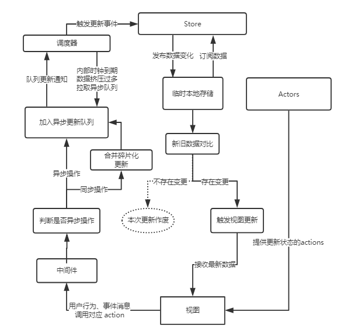

# 如何实现一个简单版的 Redux？

> 此文是公司申报创新激励的最初版本, 可能有些文不对题, 大家凑活看吧.

### 目录

```toc
```
### 目标

- [x] 流程
- [x] 原理
- [x] 解决的问题
- [x] 提炼为一个通用方法或框架（解决方案）
- [x] 描述技术方案（适当举例）
- [x] 详细的流程图
- [x] 文字描述技术方案
- [x] 明确技术效果并论证

### 流程

###### 流程图


###### 名词解释

+ View： 视图层
+ Actor（行动者）：View委派更新操作，Actor是代理执行者
+ Store（数据层）：用来存放应用的状态，一旦发生变动，就提醒 View 要更新页面

### 原理

###### 基础原理

本质就是数据的"单向流动"，将视图（数据）更新的逻辑剥离出来，由Actor统一调度。

###### 基础逻辑

1. 用户访问 View
2. View 将交互操作委派给 Actor
3. Actor 接收到委派，要求 Store 进行相应的更新
4. Store 更新后，发出一个"change"事件
5. View 收到"change"事件后，更新页面

### 解决的问题

###### 技术背景

前端的技术迭代的速度飞快，当下mvvm大行其道，这些框架一定程度上封装了之前纷繁复杂的dom操作，而且也降低了使用门槛。在应付小规模应用的时候，有约束的数据流向和传输也许并没有什么副作用，但是项目规模扩大之后，一级一级的状态/属性传输却显得特别的臃肿和低效。

###### 本方案的优势

本方案的数据总是"单向流动"，任何相邻的部分都不会发生数据的"双向流动"。这保证了流程的清晰。所有的状态变化都拘束到 Actor(s) 中进行，修改统一的数据源，然后再自上而下的重新分发，减少状态/属性传递的成本，也从根源上杜绝了状态震荡，而且本方案将数据从react中分离，则理论上所有的组件都可以是无状态组件，那么渲染性能还能够得到进一步的提升。

### 技术方案描述

###### 详细的方案流程图



###### 方案描述

1. 用户访问 View，发生交互行为，View委派Actor发起更新。
2. Actor 首先经过中间件，接着判断更新操作是否异步。若为异步，直接推入异步任务队列，若为同步，则尝试合并操作然后推入异步队列。
3. 调度器在内部时钟到期或者队列到达上限后拉取队列任务，尝试合并后依次对 Store 进行更新。
4. Store每次更新后向订阅者发布最新数据。
5. View 接收到推送的数据后，尝试比较两次的数据是否一致，若发生改变则更新视图。
6. 至此单向数据流形成闭环。

###### 竞品比较

+ 相较于 redux / flux，都只有一个 dispath 函数，使用 Actions 区分不同的更新逻辑，本方案采用 视图委托 Actors 触发更新，流程简洁。
+ redux / flux 过度分化功能模块，增加维护成本，提高开发门槛。
+ redux / flux 本身不存在 diff 更新过程，不会尝试合并更新操作，这导致大量无效的 rerender，降低页面性能，增加调式难度
